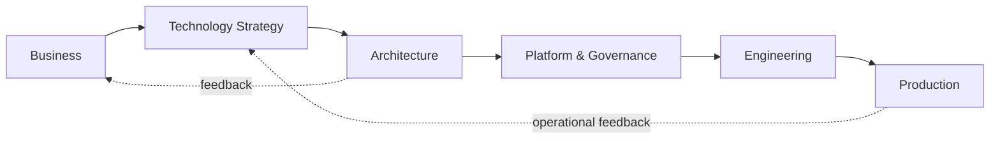
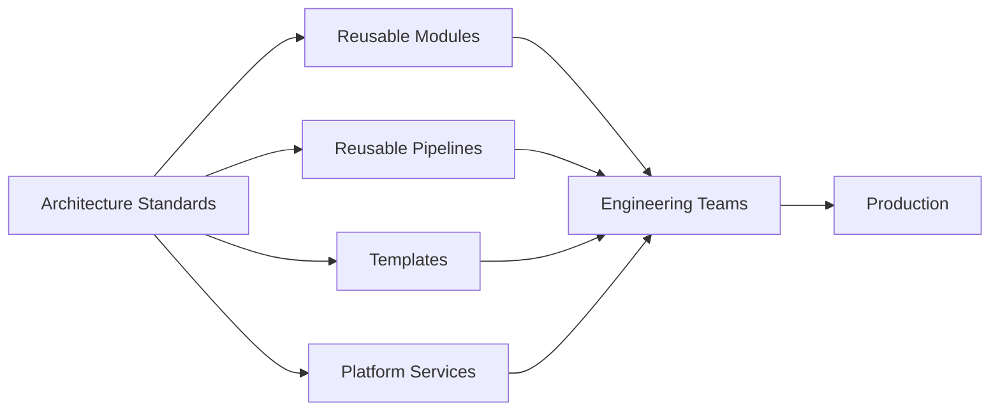
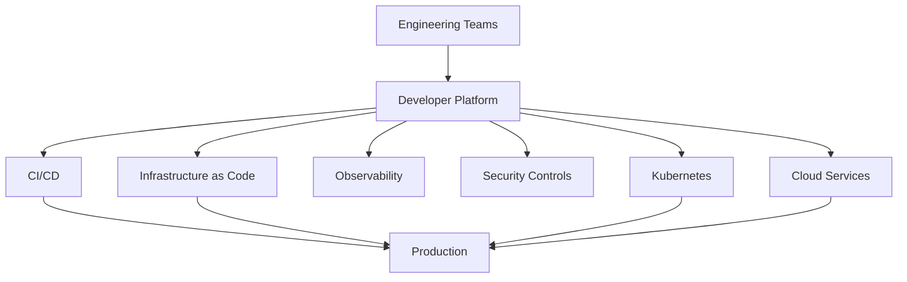
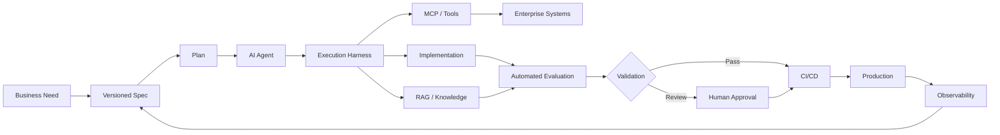
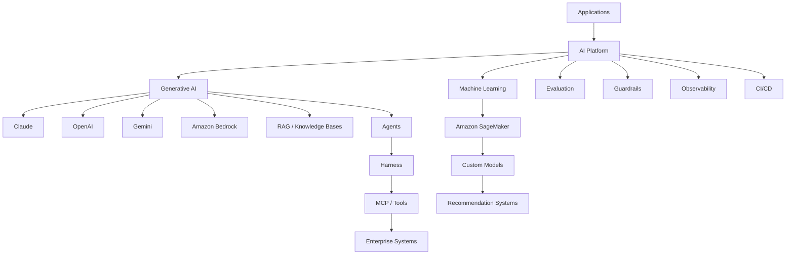
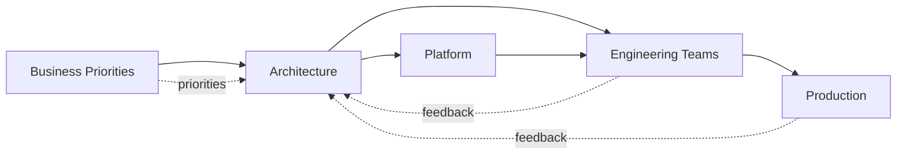

<div align="center">

# Luis Felipe Patiño

### Cloud Architect · Solutions Architect · DevOps Engineer · Technology & Engineering Leader

**AWS Golden Jacket**

Bogotá, Colombia

<a href="https://linkedin.com/in/luis-felipepl"></a> <a href="mailto:felipephat@hotmail.com"></a>

<br>

`BUSINESS` → `STRATEGY` → `ARCHITECTURE` → `PLATFORM` → `ENGINEERING` → `PRODUCTION`

</div>

---

```console
$ profile --status

BUSINESS ALIGNMENT       ● ACTIVE
TECHNOLOGY STRATEGY      ● ACTIVE
ARCHITECTURE             ● ACTIVE
CLOUD & PLATFORM         ● ACTIVE
DEVOPS / DELIVERY        ● ACTIVE
AI SYSTEMS               ● ACTIVE
TECHNICAL LEADERSHIP     ● ACTIVE
```

---

## `00 / whoami`

```console
$ whoami --verbose

8+ years working across architecture, DevOps, cloud engineering,
and technology leadership — often across several of those areas at the same time.

✓ designed reference architectures → and helped teams implement them
✓ defined engineering standards → and automated them through platforms and pipelines
✓ led technical teams → while staying close to architecture and production
✓ worked with business and technology leaders → turning priorities into technical roadmaps
✓ connected architecture, security, engineering, operations, and delivery

I work at the intersection of business, architecture, and engineering.

My role is to understand what the organization needs, translate that into
technology decisions, align teams around those decisions, and make sure
the architecture can actually be delivered and operated.
```

```console
$ cat industries.txt

banking      insurance      healthcare      education      real estate

# same architecture principles, different business,
# regulatory, operational, and risk constraints.
```

---

## `01 / strategy`

```yaml
business_to_technology:

  inputs:
    - business_objectives
    - customer_needs
    - regulatory_requirements
    - risk
    - cost
    - operational_constraints

  decisions:
    - technology_strategy
    - architecture_direction
    - modernization_priorities
    - platform_capabilities
    - cloud_adoption
    - engineering_standards

  outcomes:
    - faster_delivery
    - scalable_platforms
    - controlled_risk
    - operational_efficiency
    - sustainable_architecture
```

### From strategy to production



Technology strategy is not only about choosing technologies.

It means understanding where the business is going, identifying the capabilities
required to support that direction, and making architecture decisions that balance
delivery speed, risk, cost, scalability, and operational complexity.

---

## `02 / decision-making`

```console
$ ./architecture --trade-offs

       resilience ←────────────→ cost
            speed ←────────────→ control
         autonomy ←────────────→ standardization
       complexity ←────────────→ flexibility
     consistency ←────────────→ availability
     build        ←────────────→ buy
```

Most architecture decisions come down to trade-offs.

My job is to make those trade-offs visible, evaluate them within the business
and engineering context, and help teams choose a direction they can defend,
implement, and operate.

```yaml
architecture_decisions:
  consider:
    - business_value
    - time_to_market
    - security
    - resilience
    - scalability
    - performance
    - cost
    - operability
    - team_autonomy
    - organizational_complexity

  documented_as:
    - ADRs
    - reference_architectures
    - technology_standards
    - implementation_patterns
```

---

## `03 / leadership`

```yaml
leadership:

  scope:
    - architecture
    - cloud_engineering
    - devops
    - platform_engineering
    - security_architecture
    - technical_delivery

  responsibilities:
    - define_technical_direction
    - lead_architecture_decisions
    - align_business_and_technology
    - coordinate_cross_functional_teams
    - prioritize_technical_initiatives
    - mentor_engineers_and_architects
    - remove_delivery_blockers
    - drive_architecture_adoption

stakeholders:
  - business
  - product
  - engineering
  - security
  - operations
  - infrastructure
  - finance

team_models:
  - tribes_and_squads
  - cross_functional_teams
  - agile_at_scale

enablement:
  - architecture_sessions
  - technical_mentoring
  - knowledge_transfer
  - reference_implementations
  - reusable_platform_capabilities
```

I prefer architecture close to delivery.

That means participating in the decisions that matter, helping teams solve
complex problems, understanding operational consequences, and keeping
architecture connected to business priorities.

---

## `04 / architecture`

```yaml
distributed_systems:

  architecture:
    - microservices
    - event_driven
    - serverless
    - distributed_systems

  resilience:
    - circuit_breakers
    - bulkheads
    - retries_with_backoff
    - graceful_degradation
    - failure_isolation

  consistency:
    model: eventual
    idempotency: enforced

  interfaces:
    contracts: explicit
    APIs: first_class

application_architecture:

  patterns:
    - domain_driven_design
    - hexagonal_architecture
    - cqrs
    - event_driven_architecture
    - api_first

  frontend:
    - SPA
    - BFF
    - micro_frontends_when_justified

disaster_recovery:

  strategies:
    - multi_az
    - multi_region

  objectives:
    - RTO
    - RPO

architecture_governance:

  mechanisms:
    - ADRs
    - reference_architectures
    - reusable_patterns
    - architecture_reviews
    - automated_controls
```

<p>


</p>

---

## `05 / cloud`

```console
$ cloud architecture --provider aws

MULTI ACCOUNT        organization-level governance
MULTI REGION         resilience and disaster recovery
NETWORKING           private connectivity and segmentation
SECURITY             identity, encryption and perimeter controls
COMPUTE              containers, serverless and managed platforms
DATA                 relational, NoSQL and distributed caching
INTEGRATION          APIs, events, queues and streaming
OBSERVABILITY        metrics, logs, traces and operational visibility
```

```yaml
aws:

  compute:
    - EKS
    - ECS
    - Lambda

  networking:
    - VPC
    - Transit_Gateway
    - Load_Balancers
    - PrivateLink
    - CloudFront
    - Route53
    - API_Gateway

  security:
    - IAM
    - Cognito
    - WAF
    - KMS
    - Secrets_Manager
    - Security_Hub
    - GuardDuty

  data:
    - Aurora
    - RDS
    - DynamoDB
    - S3
    - ElastiCache

  integration:
    - EventBridge
    - SNS
    - SQS
    - Kafka

  infrastructure:
    - Terraform
    - CloudFormation
```

Cloud architecture is not just selecting AWS services.

The decisions that matter are boundaries, ownership, failure modes, identity,
networking, data, deployment models, operational complexity, cost, and how the
platform evolves as the organization grows.

---

## `06 / governance-as-code`

### Architecture should be consumable

```hcl
module "platform_governance" {

  source  = "org/platform/aws"
  version = "~> 3.0"

  identity = {
    permission_boundaries = true
    least_privilege       = true
  }

  network = {
    segmentation = "mandatory"
    egress       = "controlled"
  }

  encryption = {
    at_rest    = true
    in_transit = true
    kms        = "cmk"
  }

  logging = {
    centralized = true
    retention   = "regulatory"
  }

  threat_detection = {
    enabled = true
  }
}
```

```yaml
# .github/workflows/paved-road.yml

name: paved-road

on:
  - push
  - pull_request

jobs:

  quality:
    uses: org/.github/.github/workflows/sonar.yml@v2

  dependencies:
    uses: org/.github/.github/workflows/sca.yml@v2

  iac-security:
    uses: org/.github/.github/workflows/tf-security.yml@v2

  sast:
    uses: org/.github/.github/workflows/veracode.yml@v2

  deploy:
    uses: org/.github/.github/workflows/argo-sync.yml@v2
```

Governance works better when teams do not have to manually interpret it.

Security, architecture, compliance, and engineering standards can become part
of reusable Terraform modules, CI/CD pipelines, templates, and platform capabilities.



<p>


</p>

---

## `07 / platform-engineering`

```console
$ kubectl get platform -A

NAMESPACE      CAPABILITY                STATUS    PURPOSE
landing-zone   multi-account-aws         Running   organization governance
delivery       gitops-argocd             Running   declarative delivery
delivery       helm-golden-paths         Running   reusable deployment patterns
portal         backstage-idp             Running   developer self-service
mesh           istio                     Running   traffic and mTLS
observability  prometheus-grafana-elk    Running   metrics and logs
security       vault                     Running   secrets and dynamic credentials
```

Platform engineering turns architecture decisions into capabilities that
engineering teams can consume.



The goal is to reduce repeated work and give teams a standard path to build,
deploy, secure, observe, and operate their services.

<p>


</p>

---

## `08 / delivery`

```yaml
software_delivery:

  infrastructure:
    model: infrastructure_as_code

  pipelines:
    - reusable_workflows
    - automated_testing
    - security_scanning
    - artifact_management
    - controlled_promotion
    - deployment_automation

  gitops:
    desired_state: git
    deployment: declarative
    reconciliation: automated

  quality:
    - static_analysis
    - dependency_scanning
    - infrastructure_scanning
    - performance_testing
    - observability

  principles:
    - repeatability
    - traceability
    - automation
    - secure_by_default
    - self_service
```

Good architecture should improve delivery, not make it harder.

Standards are more useful when they are implemented as something teams can
directly consume: a module, pipeline, API, template, golden path, or platform service.

---
## `09 / ai & machine-learning`

```console
$ ai-platform --capabilities

GENERATIVE AI        Claude · OpenAI · Gemini · Amazon Bedrock
AI ENGINEERING       RAG · Agents · MCP · Tool Use · Knowledge Bases
HARNESS ENGINEERING  controlled environments for agent execution
SPEC-DRIVEN DEV      specifications as the source of truth
EVALUATION           automated evals and deterministic validation
GUARDRAILS           security · permissions · human approval
MACHINE LEARNING     custom models · recommendation systems
MLOPS                training · deployment · inference · monitoring
```

### Generative AI

```yaml
generative_ai:

  platforms_and_models:
    - Amazon_Bedrock
    - Anthropic_Claude
    - OpenAI
    - Google_Gemini

  patterns:
    - RAG
    - knowledge_bases
    - agents
    - tool_use
    - MCP
    - structured_outputs

  architecture:
    - model_abstraction
    - multi_model_strategies
    - controlled_context
    - scoped_tool_access
    - human_in_the_loop
    - auditability

  production:
    - evaluations
    - guardrails
    - observability
    - security
    - prompt_versioning
    - automated_delivery
```

I design AI systems independently of a single model provider.

The model can change. The architecture around it still needs reliable context,
controlled access to tools and enterprise systems, security, evaluation,
observability, deployment, governance, and clear operational ownership.

---

### Harness Engineering

```python
class AgentHarness:
    """
    Controlled environment where AI agents can plan,
    execute, validate and operate safely.
    """

    spec          = VersionedSpec()
    context       = ControlledContext()
    tools         = MCPServer(access="scoped")
    permissions   = LeastPrivilege()
    validation    = AutomatedEvals()
    guardrails    = Guardrails(enabled=True)
    observability = Tracing(enabled=True)
    audit         = AuditTrail(enabled=True)

    human_gate    = "when risk or compliance requires it"
```

Harness engineering provides the execution environment around an agent.

Instead of giving a model unrestricted access and relying only on prompts,
the harness defines what the agent can access, which tools it can execute,
how outputs are validated, what actions require approval, and how the entire
execution can be observed and audited.

---

### Spec-Driven Development

```yaml
spec_driven_development:

  source_of_truth:
    - requirements
    - architecture_decisions
    - interfaces
    - constraints
    - acceptance_criteria

  workflow:
    spec:
      ↓
    plan:
      ↓
    implementation:
      ↓
    automated_validation:
      ↓
    review:
      ↓
    production:

  principles:
    - specifications_are_versioned
    - decisions_are_reviewable
    - implementation_is_traceable
    - agents_work_within_defined_constraints
    - validation_is_automated_where_possible
```

AI-assisted development becomes much more reliable when the specification,
not the conversation history, defines what needs to be built.

Specs provide a stable contract that humans, agents, CI/CD pipelines, and
validation tools can work against.

---

### AI Delivery Flow



---

### Machine Learning

```yaml
machine_learning:

  platform:
    - Amazon_SageMaker

  use_cases:
    - recommendation_systems
    - predictive_models
    - classification
    - ranking
    - custom_machine_learning_models

  lifecycle:
    - data_preparation
    - feature_engineering
    - training
    - evaluation
    - model_registry
    - deployment
    - real_time_inference
    - batch_inference
    - monitoring

  mlops:
    - reproducible_training
    - model_versioning
    - automated_pipelines
    - controlled_deployment
    - performance_monitoring
```

My AI work is not limited to generative AI.

I also work with custom machine learning models, including recommendation
systems, using SageMaker for training, deployment, inference, and the
operational lifecycle around those models.

---

### AI Architecture



<div align="center">

### Models & Platforms


### AI Engineering


### Machine Learning & MLOps


</div>

---

## `10 / operating-model`

```yaml
architecture_operating_model:

  direction:
    owned_by:
      - architecture
      - engineering_leadership
      - business_stakeholders

  execution:
    owned_by:
      - engineering_teams
      - platform_teams

  controls:
    implemented_through:
      - reusable_infrastructure
      - pipelines
      - policy_as_code
      - platform_capabilities

  feedback:
    sources:
      - production
      - operations
      - engineering
      - security
      - business
```



Architecture should provide direction without becoming a bottleneck.

The objective is to create enough standardization to reduce risk and duplicated
effort while preserving the autonomy teams need to deliver.

---

## `11 / impact`

```console
$ impact --areas

MODERNIZATION             legacy → cloud-native
PLATFORM                  reusable engineering capabilities
GOVERNANCE                standards → automated controls
SECURITY                  security integrated into delivery
DEVOPS                    repeatable and automated delivery
CLOUD                     scalable and resilient architectures
AI                        production-ready AI systems
ENABLEMENT                 teams able to move independently
TIME TO MARKET             less friction in the delivery path
```

The outcome I care about is not the number of architecture documents produced.

It is whether teams can deliver better systems, faster, with the right level
of security, resilience, governance, and operational control.

---

## `12 / certifications AWS Golden Jacket`

```console
$ aws-certs list --status active

LEVEL          CERTIFICATION
─────────────  ────────────────────────────────────────────
professional   Solutions Architect
professional   DevOps Engineer
professional   Generative AI Developer

specialty      Advanced Networking
specialty      Security
specialty      Machine Learning

associate      Solutions Architect
associate      Developer
associate      CloudOps Engineer
associate      SysOps Administrator
associate      Data Engineer
associate      Machine Learning Engineer

foundational   Cloud Practitioner
foundational   AI Practitioner


$ certs list --other

hashicorp      Terraform Associate
github         GitHub Foundations
````

<div align="center">

### AWS Professional


### AWS Specialty


### AWS Associate


### AWS Foundational


### Other Certifications


</div>
```
---

## `13 / toolchain`

<div align="center">

### Cloud


### Containers & Orchestration


### Infrastructure as Code


### CI/CD & GitOps


### Platform


### Observability


### Performance & Testing


### Security & Quality


### Data & Messaging


### Languages & Runtimes


</div>

---

## `14 / education`

```console
$ cat ~/.education

M.Sc.  Information and Communication Sciences
B.Sc.  Electronic Engineering
       Universidad Distrital Francisco José de Caldas — Bogotá, Colombia
```

---

## `15 / connect`

```console
$ ./connect.sh

> cloud architecture
> technology strategy
> platform engineering
> DevOps
> distributed systems
> production AI
> technical leadership
```

<div align="center">

<br>

<a href="https://www.linkedin.com/in/luis-felipepl/"></a> <a href="mailto:felipephat@hotmail.com"></a>

</div>
